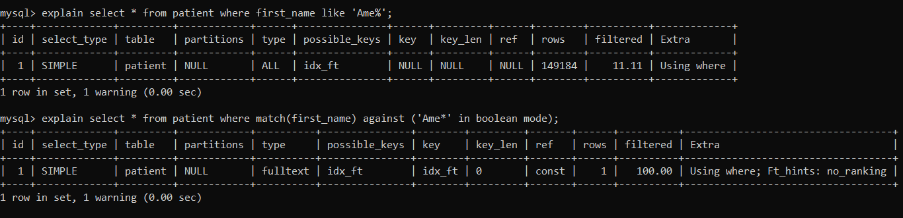

# Hospital Database System 🏥
A Flask web application for a hospital database system. 
CS 432: Databases assignment, IIT Gandhinagar.

# Table of Contents

**[Explanations](#explanations-)**<br>
**[Files](#files-)**<br>
**[Requirements](#requirements-)**<br>
**[Instructions to run the web app](#instructions-to-run-the-web-app-)**<br>
**[Examples for each command](#examples-for-each-command-)**<br>
**[Contributors](#contributors-%EF%B8%8F)**<br>   

# Explanations 📰

Click on any image to open it in a new tab. 

## Task 1

For this task, we optimised the search by using UNION clause after creating full-text indexes for both the columns _first_name_ and _last_name_ from the table _patient_, and the UNION uses both the indexes. In the unoptimised case, we just use OR clause which will not use any indexes.

**Screenshots:**


| Query Type  | Execution Time   | No. of rows scanned |
|-------------|------------|---------------------|
| Unoptimised | 0.12565350 | 31331               |
| Optimised   | 0.00627500 | 1                   |

## Task 2

For this task, we optimised the pattern matching using a full-text index on the column _first_name_ from the table _patient_. The unoptimised query does not use the index. 

**Screenshots:**



| Query Type  | Execution Time   | No. of rows scanned |
|-------------|------------|---------------------|
| Unoptimised | 0.10544800 | 16574               |
| Optimised   | 0.01251825 | 1                   |

## Task 3

We changed the datatype of the column _house_no_ from INT to TINYINT and the datatype of the column _street_ from VARCHAR(128) to CHAR(7).

**Before optimising the datatypes:**


**After optimising the datatypes:**


We do not have execution time and number of rows scanned for this task since there is no query involved. 

## Task 4
For this task, we used the column _date_of_discharge_ from the _patient_ table  to search for a particular date.
To optimise the query, we added an index on the column, which reduced the execution time to 10% and 
reduced the number of scans from 10% of the complete table to just 191 output rows.   

**Without using index (unoptimised)**  


**Using index (optimised)**  


**Comparing the execution time**  


| Query Type  | Execution Time   | No. of rows scanned |
|-------------|------------|---------------------|
| Unoptimised | 0.41267075 | 14563               |
| Optimised   | 0.04350475 | 191                 |

## Task 5

We added 2 NULL values to the column _last_name_ in the table _employee_ and used the following commands to show the differences in counts:

**Including NULL:**
```
SELECT COUNT(*) FROM employee;
```

**Excluding NULL (returns 0 for NULL and counts remaining):**
```
SELECT COUNT(last_name) FROM employee;
```

  

## Task 6
Using the following command, we can get the whether MySQL version supports query caching or not.   
```
SHOW VARIABLES LIKE 'have_query_cache';
```  

  

Hence, our MySQL version does not support query caching. 

## Task 7

For this task, we used NATURAL JOIN on the tables _doc_office_ and _doc_dept_ and compared it with a query that does not use JOINs. JOIN helps better in optimisation because in the unoptimised case (without JOIN) we have to compare each row from the subquery with every row from _doc_dept_ which is computationally intensive, whereas JOIN will create a new smaller table and we just have to check for the condition on this new table.

**Screenshots:**


| Query Type  | Execution Time   | No. of rows scanned |
|-------------|------------|---------------------|
| Unoptimised (without JOIN) | 0.23209400 | 134684               |
| Optimised (NATURAL JOIN)  | 0.16773950 | 22607                 |

## Task 8

**Nested query - 1:**


| Query Type  | Execution Time   | No. of rows scanned |
|-------------|------------|---------------------|
| Unoptimised | 0.23209400 | 145985               |
| Optimised   | 0.16773950 | 32266                 |

**Nested query - 2:**


| Query Type  | Execution Time   | No. of rows scanned |
|-------------|------------|---------------------|
| Unoptimised | 0.23209400 | 501 + x               |
| Optimised   | 0.16773950 | 501                 |

For this case, MySQL could not estimate the number of rows it needs to scan and reported it as NULL, we are assuming it to be a positive number x.

**Nested query - 3:**


| Query Type  | Execution Time   | No. of rows scanned |
|-------------|------------|---------------------|
| Unoptimised | 0.23209400 | 134684               |
| Optimised   | 0.16773950 | 22607                 |

# Files 📁

* [`contributions.txt`](https://github.com/frank-chris/HospitalDatabaseSystemV2/blob/main/contributions.txt)    
* [`hospitalDB.sql`](https://github.com/frank-chris/HospitalDatabaseSystemV2/blob/main/hospitalDB.sql)   
* [`README.pdf`](https://github.com/frank-chris/HospitalDatabaseSystemV2/blob/main/README.pdf)   
  
# Requirements ⚡
1) MySQL
2) Python 3
3) MySQLdb
4) Flask
5) Flask-MySQLdb

# Instructions to run the web app ⏩

## Install the following packages
```
pip install mysqlclient/ apt-get install python3-mysqldb
```
```
pip install Flask
```
```
pip install Flask-MySQLdb
```

## Import hospitalDB.sql (dump file) to MySQL as a database named hospitalDB

```
mysql -u tempuser -p hospitalDB < hospitalDB.sql
```

## Create a MySQL user as follows

```
CREATE USER 'tempuser'@'localhost' IDENTIFIED BY '123+Temppass';
```

## Grant permission to the account

```
GRANT ALL PRIVILEGES ON hospitalDB.* TO 'tempuser'@'localhost';
```

## Run the web app

```
python3 web_app.py
```

# Examples for each command ⭐

## Search Menu


## Search (Task-1)


**results:**


## Search (Task-4)


**results:**


## Count (Task-5)


# Contributors ✏️

### TEAM G1

* Amey Kulkarni (18110016)

* Chris Francis (18110041)

* Eshan Gujarathi (19110082)

* Hitarth Gandhi (19110087)

### TEAM G2

* Hrushti Naik (19110088)

* Shril Mody (18110162)

* Viraj Shah (18110188)

* Vishal Soni (19110207)
